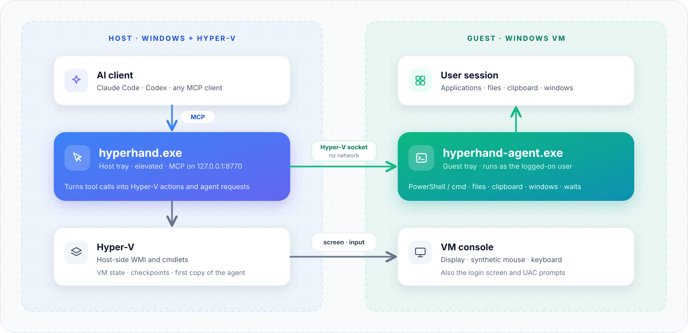

# HyperHand: Hyper-V VM Control for AI Agents

Let an AI agent such as Claude Code or Codex see and operate a Windows virtual machine on Hyper-V: observe the screen and the window's control tree, click, type, run commands, launch programs, move files and roll back to checkpoints, without a network connection to the guest and without a guest password. Built for Windows 10/11 hosts running Hyper-V with Windows guests; works with any MCP client that supports Streamable HTTP.

HyperHand has two executables and three roles:

- **`hyperhand.exe`**, an ordinary user tray program on the host. It serves MCP at `http://127.0.0.1:8770/mcp` and handles host file access.
- **`HyperHandService`**, the same host executable running as a Windows service under its dedicated account, `NT SERVICE\HyperHandService`. The tray delegates Hyper-V operations through an access-controlled local named pipe; the service connects to the guest over a Hyper-V socket.
- **`hyperhand-agent.exe`**, a tray program inside the guest. It runs commands, launches programs, transfers files and handles the clipboard, windows and UI Automation controls in the logged-on user's session, talking to the host over a Hyper-V socket.

<picture>
  <source media="(prefers-color-scheme: dark)" srcset="docs/images/architecture-dark.svg">
  
</picture>

## Features

- **One observation, then act on it**: `vm_observe` returns a screenshot of the screen or of one window, the focused control and, on request, the window's UI Automation control tree as indexed text, under an `observation_id`. Actions take that id with image pixels or a control index; the host maps pixels back to the screen, re-finds controls and refuses stale observations. No coordinate arithmetic on the AI's side.
- **Actions that prepare themselves**: `vm_click`, `vm_type`, `vm_set_value` and the others activate the target window first, check that it is enabled, not covered and reachable, perform the action and return a fresh observation (`after`) in the same call.
- **Screen, mouse and keyboard from the host**: the screenshot and raw mouse and keyboard input go through Hyper-V and work on the sign-in screen and UAC prompts too, since they do not depend on anything running in the guest.
- **Commands and programs in the guest**: run PowerShell or cmd in the user's desktop session and get the exit code, stdout and stderr back, optionally elevated; `vm_launch` starts a GUI program detached and returns its window handle.
- **File transfer**: copy files or whole directories in either direction. Uploads skip files whose SHA-256 already matches the guest copy. Directory mirror mode first previews changes, then copies, verifies and removes extra guest files; ordinary uploads never delete them.
- **Checkpoints**: list the tree, create, restore, keep and delete, selecting by stable `id`; `vm_end_turn` deletes the temporary checkpoints of a turn, keeps the ones marked `keep`.
- **Clipboard, windows and waiting**: read and write the guest clipboard, list windows with their owner groups, focused control and session state, and wait for process or file conditions.
- **Start to a usable desktop**: `vm_start` waits until the agent answers and the session is unlocked. If Windows locked the session after signing in, it types the unlock password you stored in the tray; `vm_status` reports power, agent and lock state, `vm_doctor` diagnoses host and guest.
- **Results an AI can act on**: every result is one JSON object; every error is a JSON object with an error code, the reason and `next`, the call that makes progress.
- **No guest network; guest password optional**: host and agent talk over a Hyper-V socket; the agent is copied in with Hyper-V's guest file copy and installed from the keyboard. A guest password is needed only if you want HyperHand to unlock a locked session; it stays in Windows Credential Manager on the host.
- **Cancellation**: when the MCP client cancels a long command, the agent kills it and is ready for the next request immediately.
- **No UAC during normal host use**: install or update the service once with administrator approval, then start or restart the tray as an ordinary user. Restarting the tray reconnects MCP without restarting the service or any VM; in-progress requests are interrupted.

## Requirements

- Windows 10/11 Pro or Enterprise host with Hyper-V, and administrator approval for installation, updates and uninstallation. Normal tray use does not require elevation.
- A Windows guest with a logged-on user. Sign the user in automatically, or store an unlock password in the tray so that `vm_start` can unlock a session Windows locked after signing in.
- VMConnect in basic session mode. Enhanced session moves the user's session to remote desktop, so host-side screenshots and input would reach the console lock screen instead.
- Go 1.27 or later, only to build from source.
- An MCP client that supports Streamable HTTP: Claude Code, Codex, Cursor and others.

## Install

Download `hyperhand-X.Y.Z-windows-amd64.zip` from [Releases](https://github.com/n2ns/hyper-hand/releases) and extract both executables to the same folder. Then run:

```powershell
hyperhand.exe install
```

`install` asks for UAC once, copies both executables to `%ProgramFiles%\HyperHand`, installs the automatic `HyperHandService` service and starts the ordinary tray. Only the dedicated service account is added to Hyper-V Administrators; your user account is not. The `HyperHand` logon task runs the installed tray with least privilege, replacing an older highest-privilege task. The on-demand `HyperHand Console` task lets the tray open Virtual Machine Connection for a VM without a UAC prompt (see [Watch a VM](docs/user-guide.md#watch-a-vm)). Run `install` again from a new release to update the installation.

To build from source instead (the version then reads `dev`):

```powershell
go build -ldflags "-H windowsgui" -o build\hyperhand.exe .\cmd\hyperhand
go build -ldflags "-H windowsgui" -o build\hyperhand-agent.exe .\cmd\hyperhand-agent
build\hyperhand.exe install
```

## Quick start

1. Add HyperHand to your MCP client and start a new session:

   Claude Code:

   ```powershell
   claude mcp add --transport http hyperhand http://127.0.0.1:8770/mcp
   ```

   Codex:

   ```powershell
   codex mcp add hyperhand --url http://127.0.0.1:8770/mcp
   ```

   Other clients: add a Streamable HTTP server with the URL `http://127.0.0.1:8770/mcp`.

2. Start the VM and log on in the guest. Switch the guest keyboard to English: the agent's install command is typed on the keyboard, and an input method in Chinese mode would garble it.
3. Ask the AI to install the agent (`vm_install_agent`). It copies the agent into the guest, runs its installer and waits until it answers. The agent then starts at every logon. Alternatively, copy `hyperhand-agent.exe` into the guest yourself and run `hyperhand-agent.exe install` there; see [Install the guest agent manually](docs/user-guide.md#install-the-guest-agent-manually).
4. Ask the AI to work in the VM: observe the screen, open an application, run a command, copy a build in, restore a checkpoint. Optionally add `vm_end_turn` as a Stop hook (examples in [docs/hooks/](docs/hooks/)) so that temporary checkpoints are cleaned up after every turn.

## Tools

Every tool except `vm_list` requires `vm` (the VM name from `vm_list`); there is no default VM. A call without it is refused with `invalid_argument` and the VM names in `next` and `vms`. Only `vm_end_turn` may omit it, to end the whole task (as the Stop hook examples do); `all_temp: true` requires it.

| Tool | What it does |
|---|---|
| `vm_list`, `vm_start` | List VMs with their state and the task's `run_id`; start and wait until the desktop is usable (unlocking it with the stored password) |
| `vm_shutdown`, `vm_turn_off` | Shut the guest down normally and wait until the VM is off (fails, without turning it off, if a program blocks shutdown); turn the VM off immediately, like pulling the plug |
| `vm_status`, `vm_unlock`, `vm_doctor` | Report power state, agent, session lock state and whether an unlock password is stored; unlock a locked session with the stored password; run read-only host and guest checks with a suggestion per problem |
| `vm_checkpoints`, `vm_checkpoint` | List the checkpoint tree (`id`, `name`, `parent`, `type`, `kind`, `state`, `current`, `children`, plus the VM's `checkpoint_type` and `current_parent`); create one named `<run_id>-temp-<label>` (or `-keep-` with `keep: true`) and return its `id` |
| `vm_restore` | Restore a checkpoint by `id` (or by `name` when it is unique) and start the VM unless `start` is false; `save_current: true` first saves the current state as a `temp` checkpoint |
| `vm_checkpoint_keep`, `vm_checkpoint_delete` | Rename a `temp` checkpoint to `keep` so that `vm_end_turn` leaves it alone; delete a checkpoint by `id` (`manual` ones by `id` only), with `subtree: true` its whole branch, waiting for Hyper-V to merge the disks |
| `vm_windows` | List visible windows: handle, title, class, process, rect, enabled, foreground, owner, `group_root`, `integrity`; plus the foreground handle, the focused control and the session state |
| `vm_observe` | The observation entry point: PNG of the screen or of one window (`handle`), the focused control, `selected_text` and with `controls: true` the indexed control tree (`diff_from` for changes only); returns an `observation_id` |
| `vm_find_controls` | Bounded control search by AutomationId, name or type; returns actionable indexes and explicit unique/multiple/not-found/incomplete status |
| `vm_click`, `vm_drag`, `vm_scroll` | Mouse at image pixels of an `observation_id`, or at a control `index` (`vm_click`); `button`, `count`, `modifiers`, `delta_y`/`delta_x`; without an observation, raw screen pixels |
| `vm_set_value`, `vm_invoke` | Set a control's value, Invoke, Toggle, Expand, Collapse, Select, ScrollIntoView, or ScrollUp/Down/Left/Right by its observation `index`; returns actual `state` and read-back `verified` (unknown outcomes remain null) |
| `vm_type`, `vm_key` | Type Unicode text into a window (`handle`/`pid`, or an observation `index` to focus first) as key events, never through the clipboard; press one key combination or a `sequence` (numeric keypad and X11-style names included) |
| `vm_apps` | Find launchable desktop applications by name or executable path; return stable IDs, `launch` arguments for `vm_launch`, running state and visible window handles |
| `vm_launch` | Start a program detached and return its `pid` and first window's `handle`, `title` and `class` |
| `vm_exec` | Run a command to completion in the guest; `shell`, `cwd`, `timeout_ms`, `admin` |
| `vm_push`, `vm_pull` | Copy files or directories host to guest and back; `vm_push` skips unchanged files unless `force` is true. `mode: mirror` synchronizes exact directory contents with `phase: plan` then `phase: apply` and the returned `plan_id` |
| `vm_clipboard_get`, `vm_clipboard_set` | Read or write the guest clipboard |
| `vm_wait` | Wait for a process, file or UI condition; check or assert window/control state |
| `vm_end_turn` | End this task's work: cancel its waits, clean up its temporary checkpoints and release its VM ownership; `vm` limits cleanup to one VM |
| `vm_install_agent`, `vm_update_agent` | Install or replace the guest agent |

The host screenshot, raw mouse and keyboard input (actions without `observation_id`, `handle` or `pid`), VM and checkpoint tools work without the agent; window lists, control trees, control search, targeted actions, Unicode text, launching, commands and files need it. Without the agent, `vm_start` still starts the VM but reports that the desktop is not usable.

For controls beyond a large window's snapshot limit, `vm_find_controls` returns an `observation_id` and match indexes usable directly by control actions and `vm_wait`. Pass the pair to `vm_observe` to read just that subtree. Search observations contain no screenshot, so they support control indexes rather than image-pixel targets.

Actions take `observation_id` from `vm_observe` and either image pixels of that observation's screenshot or a control `index` of its tree; the host converts and checks them. By default they activate the target window, refuse a disabled, covered or stale target, and return the window that received the input plus an `after` observation (`observe_after`: `none`, `screenshot`, `controls`, `both`). Titles are not selectors: pass a `handle` from `vm_windows`, `vm_observe` or `vm_launch`. Every result is one JSON object; every refusal is an `isError` result whose text is `{"error": <code>, "reason": "...", "next": "...", "run_id": "...", ...}`, where `next` names the call that makes progress (for example `stale_observation`: call `vm_observe` again; `agent_outdated`: call `vm_update_agent`). See the [tool guide](docs/user-guide.md#using-the-tools) and [precise behavior](docs/features.md).

Every tool accepts `task_id`; resolved results return it with the task's `run_id`. A dedicated persistent MCP session gets a default task. Reconnecting scripts and agents sharing a session must pass a consistent explicit ID, including on `vm_end_turn`; deleting a session ends its default task and releases its VMs once its calls have returned. Old coordinates are refused after tracked VM mutations, window changes or significant visual changes near the target. Use an action's `after` observation or call `vm_observe` again; stable UI Automation runtime IDs can still be re-located after ordinary input.

## Known limitations

- One writing task per VM at a time: other tasks may observe, but cannot write until the owner calls `vm_end_turn`. Task ownership prevents accidental interleaving; it is not authentication. Use distinct `task_id` values for agents sharing an MCP session, and reuse the same ID across short-lived connections.
- `vm_install_agent` types its command on the keyboard; the guest input method must be in English mode. Installing the agent manually avoids this.
- `admin` commands elevate without a prompt only if the guest's UAC is set to elevate administrators without prompting; otherwise the UAC wait counts toward the command timeout. A late approval cannot execute a cancelled or expired request.
- Host-side screenshots and input act on the VM console; they do not reach a remote desktop or enhanced session. Actions refuse such a session with `session_unusable`.
- Checkpoints cannot be renamed freely: `vm_checkpoint_keep` only turns a `temp` checkpoint into a `keep` one (with an optional new label). Deleting a checkpoint merges its disk differences, which can take minutes; the call waits for it (up to 15 minutes).
- Control trees depend on the application's UI Automation support; custom-drawn controls may be missing, so some targets are reachable only by image pixels.
- HyperHand unlocks only a session that is signed in and locked, with its agent running: it cannot sign a user in at the sign-in screen after a cold boot. Use automatic sign-in for that. The unlock password must be ASCII (the Hyper-V keyboard types ASCII only); store the PIN instead if the lock screen asks for one.

## Privacy

HyperHand sends no telemetry and makes no network connections beyond the local MCP endpoint on `127.0.0.1`. Host and guest talk over Hyper-V sockets. The MCP endpoint has no authentication: any local process that can reach `127.0.0.1:8770` can control the VMs, including unlocking a VM with a stored unlock password (the password itself is never returned). Unlock passwords are stored in Windows Credential Manager for your user. See [docs/privacy.md](docs/privacy.md).

## Uninstall

Guest first, then host:

1. Guest: run `%LOCALAPPDATA%\HyperHand\hyperhand-agent.exe uninstall` in the guest itself, by hand or from the host with `vm_key` `win+r` and `vm_type`. Not through `vm_exec`: the uninstall stops the agent that would be running it. It deletes the `HyperHandAgent` Run value and the folders `%LOCALAPPDATA%\HyperHand` and `C:\Users\Public\HyperHand`.
2. Host: run `hyperhand.exe uninstall` (one UAC prompt). It removes the installed service, its Hyper-V group membership, the `HyperHand` logon task, the `HyperHand Console` task and the Hyper-V socket registration, then removes the installed executables if their hashes still match. User logs, guest files and nonempty service working data are preserved.
3. Remove the server from your MCP client. See the user guide for installed files and logs.

Details in the [user guide](docs/user-guide.md#uninstalling).

## Documentation

- [User guide](docs/user-guide.md): setup step by step, updating, releasing, troubleshooting.
- [Features](docs/features.md): detailed behaviour of every tool.
- [Privacy](docs/privacy.md): what is stored and what goes over the wire.
- [v0.2.0 acceptance](docs/acceptance-v0.2.0.md): tested environments, results and remaining coverage.
- [Changelog](CHANGELOG.md)

## Disclaimer

HyperHand is an independent project, not affiliated with or endorsed by Microsoft or Anthropic. Hyper-V is a trademark of Microsoft. HyperHand gives an AI full control of your virtual machines; use it with VMs you can afford to lose and keep checkpoints.
